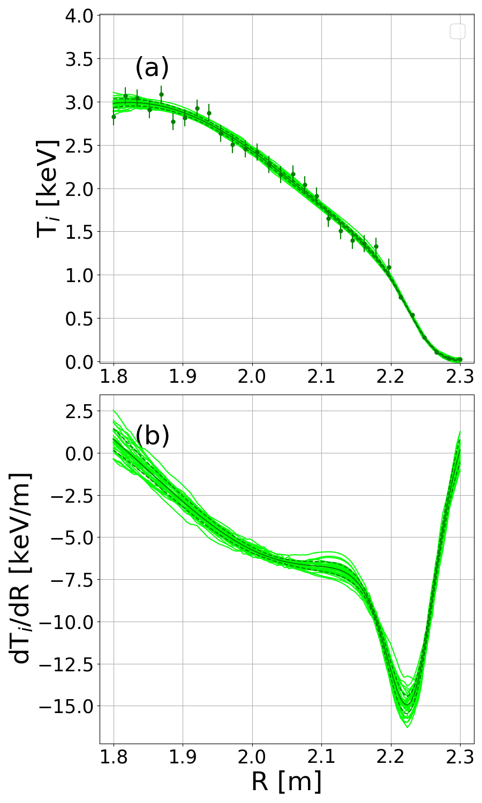

1-D profile inference with outlier detection using Support vector machine regression and Gaussian process regression
===========================================

# Descriptions

**< Reconstructed profile using GPR with MAP estimator >**

